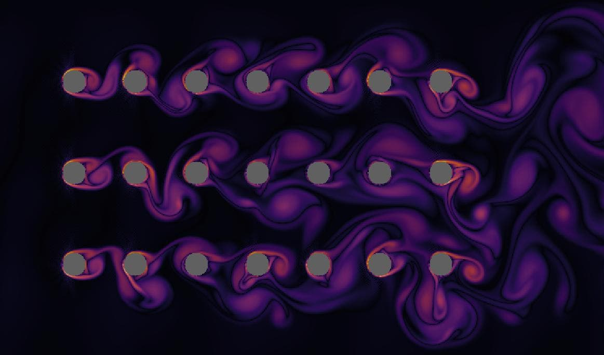

# LBM_physics_experiments
Lattice-Boltzmann Algorithm using CUDA and SFML and ImGui libraries

for build need next dependencies:
-----
* [SFML 2.5.1](https://github.com/SFML/SFML)
* [Dear ImGui](https://github.com/ocornut/imgui)
* [ImGui-SFML v2.5](https://github.com/eliasdaler/imgui-sfml)
* CUDA
* CUDA Toolkit
